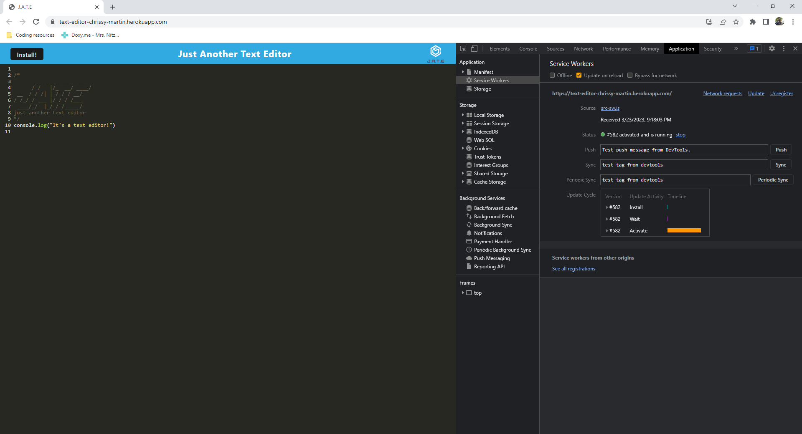

# Text Editor
  

## Description

 A simple text editor app that can function both online and offline, with a variety of data persistence options in order to ensure that data is not lost in any scenario. The application first looks to use the data in the indexedDB to populate the editor, then if it cannot access that it will use local storage. For use offline, this application can be downloaded to your desktop as an application.

## Table of Content
- [Installation](#installation)
- [Usage](#usage)
- [License](#license)
- [Contribution](#contribution)
- [Testing](#testing)
- [Questions](#questions)

## Installation:

There are no installation instructions for this application

## Usage:

Simply go to the deployed application. For offline use, go to the link and hit the "install" button to install the app locally. You can find the deployed Heroku app here: https://dashboard.heroku.com/apps/text-editor-chrissy-martin

The following image shows the application's `manifest.json` file:

The following image shows the application's registered `service worker`:

The following image shows the application's `IndexedDB` storage:

## License:

N/A

-----

## Badges:

## Contribution:

N/A

## Testing:

There are no testing instrucitons currently.

## Questions:

- Github: [chrissy-martin](https://github.com/chrissy-martin)
- Email: cmart131@yahoo.com 